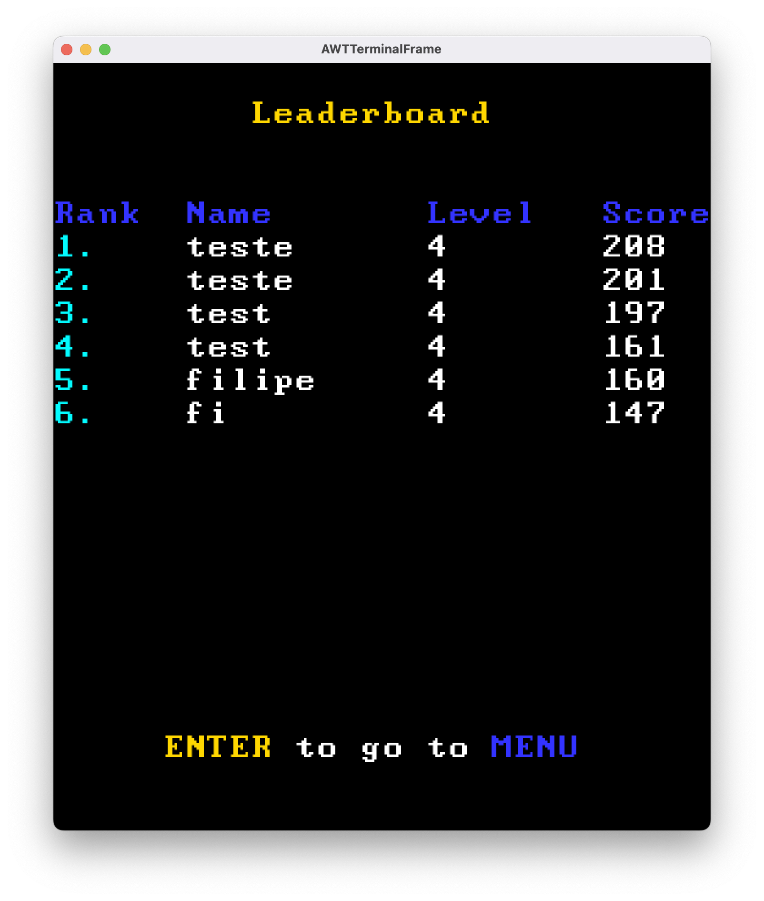
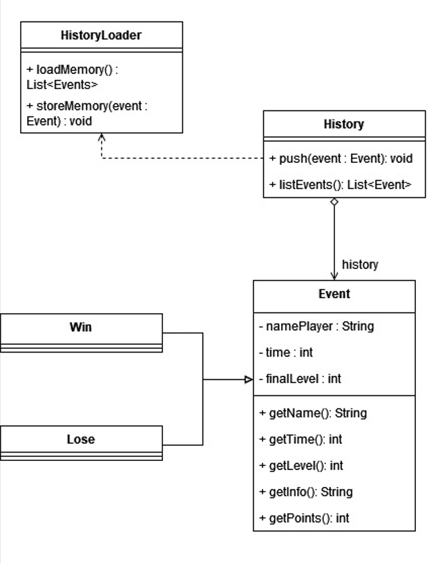
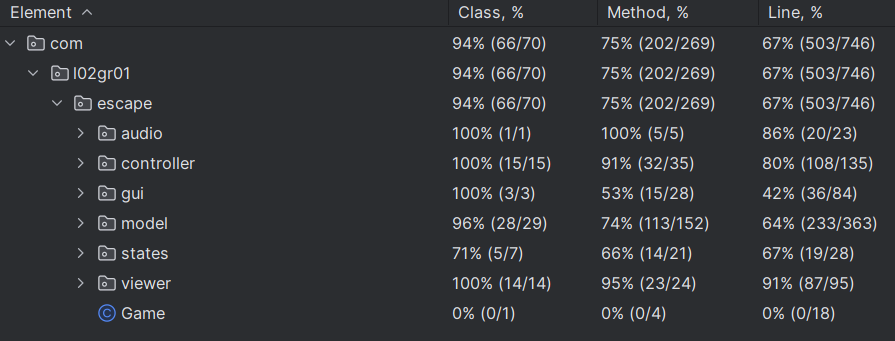

# LDTS_02_G01 - Escape

> Include here one or two paragraphs explaining the main idea of the project, followed by a sentence identifying who the authors are.


In this game, your mission is to escape from the arena after grabbing all keys to open the exit door. But, you must run away from the monsters! Oh.. By the way, Your visibility is extremely reduced, but there are some powers to help you out! 

This project was developed by *Filipe Correia* (*up202206776*@up.pt), *Gonçalo Remelhe* (*up202205318*@up.pt) and *Ricardo Morais* (*up*@up.pt) for LDTS 2023⁄24.

## IMPLEMENTED FEATURES

> This section should contain a list of implemented features and their descriptions. In the end of the section, include two or three screenshots that illustrate the most important features.
- **Dynamic Arena**: The game arena changes in every level, offering new challenges.
- **Enemies**: There are different types of Enemies, some stronger than others!
- **Key and Door Mechanism**: Players must find keys scattered across the arena to unlock the exit door.
- **Power-Ups**: Introducing power-ups that can temporarily enhance the player's abilities.
- **Limited Visibility**: The player can only see the elements near himself.
- **Gun for the player**: The player may shoot on the monsters. Monsters are killed after 2 shoots. But, ammunition is limited: You get 5 bullets for each key grabbed. If you don't have bullets, you have to run!
- **Score System**: Points are awarded based on speed and the number of keys collected.
- **Leaderboard**: The leaderboard is the interface where players can find the scores of the last players and compare their scores
- **Username Form**: The users can register their name associated with the score, due to the collection of the name before game start. 


Here are some screenshots of the game functionalities as of 26/11:





## PLANNED FEATURES

> This section is similar to the previous one but should list the features that are not yet implemented. Instead of screenshots you should include GUI mock-ups for the planned features.

We implemented all features that we planned.


## DESIGN

> This section should be organized in different subsections, each describing a different design problem that you had to solve during the project. Each subsection should be organized in four different parts:
>- **Problem in Context.** The description of the design context and the concrete problem that motivated the instantiation of the pattern. Someone else other than the original developer should be able to read and understand all the motivations for the decisions made. When refering to the implementation before the pattern was applied, don’t forget to [link to the relevant lines of code](https://help.github.com/en/articles/creating-a-permanent-link-to-a-code-snippet) in the appropriate version.
>- **The Pattern.** Identify the design pattern to be applied, why it was selected and how it is a good fit considering the existing design context and the problem at hand.
>- **Implementation.** Show how the pattern roles, operations and associations were mapped to the concrete design classes. Illustrate it with a UML class diagram, and refer to the corresponding source code with links to the relevant lines (these should be [relative links](https://help.github.com/en/articles/about-readmes#relative-links-and-image-paths-in-readme-files). When doing this, always point to the latest version of the code.
>- **Consequences.** Benefits and liabilities of the design after the pattern instantiation, eventually comparing these consequences with those of alternative solutions.


### UML

The initial UML for our game is available [here](ldtsUML.jpg).

The final UML of our game as generated by IntelliJ IDEA can be found [here](uml_complete.png).


---

### Model-View Controller

In this project, we implemented the Model-View Controller, to allow separation of code related with the model, the viewer and the controls.


---

### Leaderboard History

**Problem in Context**

We wanted to store the score of previous players to allow comparison. While we could have a list on the "Game" class, that would disrupt the **Single Responsibility Principle**.

**Pattern**



The implementation of the leaderboard history led us to the use of the Command Pattern.

This way, we decided that Level will have a History object, that will store the list of events
that happened in the game, such as losses and wins. These losses and wins inherit methods and attributes 
from the class "Event".

Additionally, the History Class shouldn't be instantiated more than once, so we will implement the
Singleton Pattern to it. 


**Implementation**

Using these patterns, we can use code similar to:
```
History history = History.getInstance() // due to the singleton pattern
history.push(new Win('Name', 70, 3) // Name of Player, Time playing in seconds, Level ended
```
anywhere in the code.

*The specifics of the code are subject to change.*


**Consequences**

Using these patterns, allows easy inclusion of new events on any part of the code and listing of the history saved.
This also guarantees the efficiency of code, as we know that for each load of the game, it will only run once the load of data 
from the memory file (at HistoryLoader.java).

---

### Different Stages of The Game

**Problem in Context**

We needed to handle the different stages of the game, such as the instruction stage, the pre-game stage (where we ask the user's name), the game stage
and the leaderboard stage. However, we didn't want to add long conditionals in Game.


**Pattern**


This lead to the use of State Pattern, because it facilitates changing the state of the game at the runtime whenever the user interacts with the game or when something important happens.


**Implementation**

We created a state for each stage of the game, inheriting from the State class.

Files: [State.java](../src/main/java/com/l02gr01/escape/states/State.java), [MenuState.java](../src/main/java/com/l02gr01/escape/states/MenuState.java), [LeaderBoardState.java](../src/main/java/com/l02gr01/escape/states/LeaderBoardState.java), [InstructionState.java](../src/main/java/com/l02gr01/escape/states/InstructionState.java), [GameState.java](../src/main/java/com/l02gr01/escape/states/State.java)


**Consequences**

Using State Pattern, it becomes easy to change states during the game and behaviour is easily updated by this change.


### Game Loop

**Problem in Context**

Using a simple game logic, the game would run extremely fast on powerful computers and slow on slower machines.

**Pattern**

To solve this issue, we implemented the game loop, which decouples the progression of the game
from the user input and processor speed.

**Implementation**

We track the passage of time and guarantee that the time between each "step" method invocation is always constant. 

File: [Game.java](../src/main/java/com/l02gr01/escape/Game.java)

**Consequences**

This implementation guarantees smooth and equal functioning throughout all devices
that may use our game.

---

### Having different moving strategies for enemies

**Problem in Context**

We wanted to guarantee that while some enemies where easy to run away from, some would try to follow the user.

**The Pattern**


For this, we used the Strategy Pattern. This means that we can decide the moving strategy of each enemy without having to
create a lot of different classes for each enemy moving strategy. And, facilitates the management of enemies in the Controller 
and Viewer part.

**Implementation**

This feature will be implemented as depicted in the UML. There will exist a MovingStrategy abstract class that will
have a method moveEnemy. Then, some method strategies will inherit this class. 
The Enemy will have a MovingStrategy associated.

Files: [MovingStrategy.java](../src/main/java/com/l02gr01/escape/model/elements/enemies/MovingStrategy/MovingStrategy.java), [HorizontalMovingStrategy.java](../src/main/java/com/l02gr01/escape/model/elements/enemies/MovingStrategy/HorizontalMovingStrategy.java), [RandomMovingStrategy.java](../src/main/java/com/l02gr01/escape/model/elements/enemies/MovingStrategy/RandomMovingStrategy.java)


**Consequences**

This pattern allows for easy selection of the moving algorithm for the enemies and easy inclusion of new algorithms of
movement for enemies.

--- 

### Reading User Name at Pre-Game

**Problem in Context**

We wanted to receive the name of the player before game start. 
However, we didn't want to create a form using the lanterna given methods. Therefore, we were dependent
of reading the characters pressed on the keyboard.

**The Pattern**


To implement this functionality, we decided to use a modification of the Observer Pattern.
We also used the singleton pattern.
The other options we were considering required a lot of code for single use.

**Implementation**

We are receiving the keyboard characters at the Lanterna GUI and sending them to TextManipulation, a class that implements the singleton pattern.
If there is some place in the game that has signaled interest in reading text, it stores it in a class variable.
After each write, the observer (usually, the PreGame class) is informed of the changes and stores it in her own variable.
In the end, the observer can state his disinteress on continuing reading characters.

(There can only be one observer in our implementation, which fits well on our game.)

Files: [TextManipulator.java](../src/main/java/com/l02gr01/escape/gui/text/TextManipulator.java)), [TextObserver.java](../src/main/java/com/l02gr01/escape/gui/text/TextObserver.java)

**Consequences**

Using this pattern, the task of reading characters from the user's keyboard becomes a trivial functionality (the class object just needs to be signaled as observer of the TextManipulation singleton)


---
### Play Sound During the Game

**Problem in Context**

We wanted to entertain the player with some sound. However, we didn't want the sound to be controlled inside the model. 
Additionally, we didn't want a song to play at the same time as another song, so control of the music should be centralized.

**The Pattern**


Therefore, to comply with this requirement, we decided to use the Singleton pattern on the AudioManager class.

**Implementation**

We implemented a getInstance method as static, which creates the object on demand (stored in a static variable) and returns always the same instance.

Files: [AudioManager.java](../src/main/java/com/l02gr01/escape/audio/AudioManager.java)

**Consequences**

The pattern we use, guarantees the uniqueness of a AudioManager object. This leads to easier audio management and, the fact 
that the object is not initialized on start of the game, can also contribute to save some memory space in case we decided that the audio was not needed.


---

We also applied the Singleton to the Game class, to guarantee that there is only one Game running at a time.

In the rest of the project, we tried to follow the SOLID principles, making use of polimorphism and other good practices.
However, there are still some code smells.

------

#### KNOWN CODE SMELLS

> This section should describe 3 to 5 different code smells that you have identified in your current implementation.

- Large "Level" Class: The Game level class has grown too large and might benefit from decomposition.
- The Enemy class is storing information about the model and the view, which affects the model-view-controller separation. However, the other alternatives (move the color logic to the viewer or create class for each enemy) forced the use of too many conditionals or would lead to an explosion of classes (i.e. severe increase in the number of classes with just a constructor).


### TESTING

- Screenshot of coverage report.



We believe it's important to note that we have used property based testing on certain class methods. 


- Link to mutation testing report.


### SELF-EVALUATION

> In this section describe how the work regarding the project was divided between the students. In the event that members of the group do not agree on a work distribution, the group should send an email to the teacher explaining the disagreement.

The initial UML structure was designed by Filipe Correia and transformed to a digital UML by Gonçalo Remelhe.

Filipe Correia and Ricardo Morais developed initial structure of the code and some initial functionalities. 
Gonçalo Remelhe developed the code related with Instructions and tests.

After the first delivery, the work was divided in a equilibrated way.
The font used was designed by Ricardo Morais.

Filipe Correia overviewed the code design and wrote the README files.

- Filipe Correia: %
- Gonçalo Remelhe: %
- Ricardo Morais: %